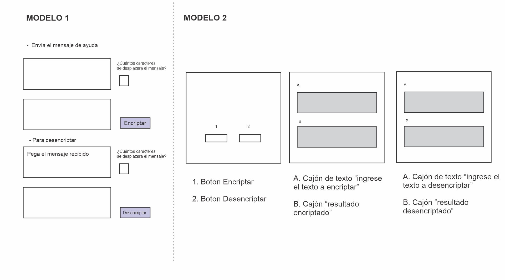
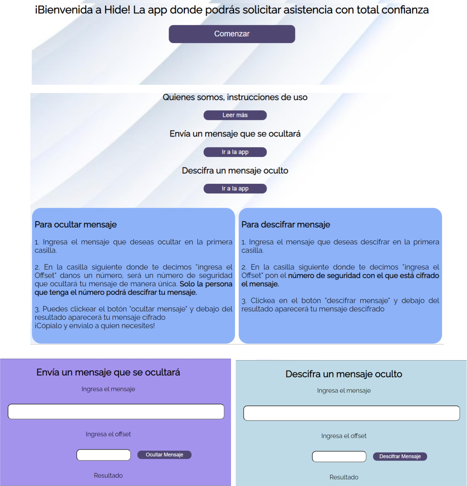
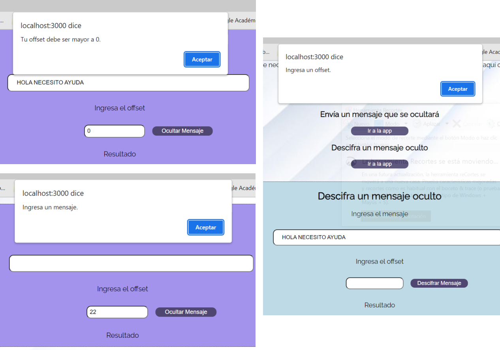

# Hide - Asistencia para Mujeres Víctimas de Violencia

## Usuarias Principales

Esta aplicación está dirigida a mujeres de cualquier rango de edad que cuenten con acceso a internet, estén siendo víctimas de violencia y necesiten pedir ayuda. La aplicación tiene como objetivo brindar protección a través del ocultamiento de los mensajes.

### Objetivos de las usuarias

- Acudir a una ayuda confiable sin ponerse en riesgo con sus victimarios.

- Encontrar una plataforma segura y discreta que disminuya el riesgo de ser descubierta.

- Evitar la exposición al riesgo al recibir mensajes de quienes le ayudarían.

- Librarse de su situación de víctimas con la mayor seguridad posible.
___

## Aporte del producto

La violencia contra la mujer es una problemática social que debería erradicarse y, por tanto, ser intervenida de inmediato en todas las esferas posibles. Según los estudios revisados para la realización del proyecto, las mujeres que se encuentran en condición de víctimas normalmente viven con sus victimarios y, en los motivos por los que las mujeres no solicitan ayuda, están principalmente **el miedo a las represalias y la vergüenza.** según este estudio, muchas mujeres no solicitan ayuda porque no se sienten seguras y consideran que al ser descubiertas el peligro va a aumentar, igual que el *"que dirán"* y el *"no querer que se sepa"*.

Entre los factores de protección que facilitan el enfrentar la violencia está el que las mujeres víctimas perciban que cuentan con apoyo y maneras para concretar su objetivo:  

*"la decisión de salir de una relación de violencia de género en la pareja no depende solo de factores individuales y externos, pues aunque la mujer desee interrumpir la relación, resulta importante que ella perciba que tiene medios (apoyo social, apoyo institucional, recursos materiales) para concretar este objetivo."* (Alencar-Rodrigues, R. D., & Espinosa, L. M. C., 2014).

Teniendo en cuenta estos dos elementos, la aplicación ***Hide*** tiene el objetivo de aumentar la posibilidad de que las mujeres víctimas de violencia pidan ayuda para cambiar su condición, proporcionando esta herramienta como *el recurso material para hacerlo con protección y privacidad* para de esta manera disminuir la sensación de miedo a las represalias, la vergüenza, y pedir la ayuda que tanto necesitan.

___
### Ideación

Para idear esta aplicación se tuvo en cuenta la interfaz de otras aplicaciones que están orientadas a disminuir la violencia de género. Al explorar estas aplicaciones se eligieron los siguientes elementos:

- Las aplicaciones tienen la apariencia de ser de "estilo de vida" y nunca una línea de emergencia.
- Se deben evitar colores o símbolos asociados con el peligro.
- Se deben evitar palabras como "victima", "violencia", "ayuda", "SOS".

### Prototipado (sketching)

Los primeros prototipos de la aplicación estaban orientados únicamente a la funcionalidad del cifrado, como se ve en los dos modelos a continuación. 

El primer modelo era una sola pantalla y no contemplaba la bienvenida, las instrucciones y un lenguaje amigable para las usuarias. Esta última versión incluye todo esto.

Adicionalmente la aplicación cuenta con mayor interactividad (una que no se había contemplado en los primeros prototipos) con las alertas correspondientes para el correcto uso de la aplicación.

## Referencias

Alencar-Rodrigues, R. D., & Espinosa, L. M. C. (2014). ¿ Cómo mujeres inmigrantes enfrentan la violencia en la relación de pareja?. Estudos de Psicologia (Natal), 19, 4-12.

Gómez, Y. F., Méndez-Valdivia, M., Izquierdo, M. C., Muñiz, C. L., Díaz, F. J. R., Herrero, F. J., & Coto, E. E. (2002). Mujeres maltratadas por sus parejas masculinas. Psicothema, 130-138.